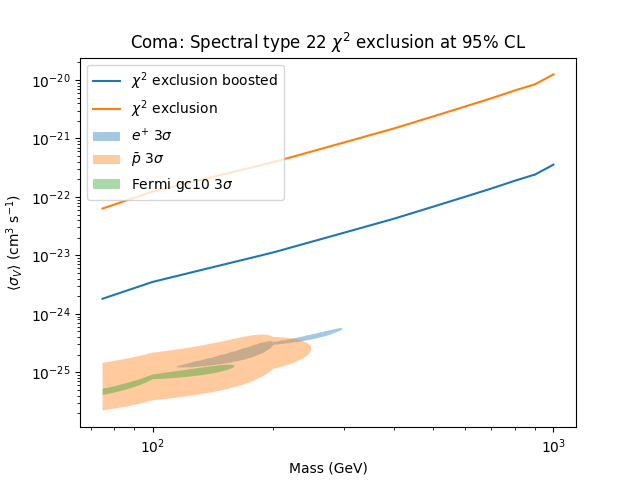

# Honours Project

This is the code used in my physics honours research project, 2021. It studies the Madala boson dark matter candidate's indirect detection prospects through gamma-rays emitted after annihilation. 

The accompanying pdf for the writeup will be uploaded to this repository soon, and gives more detail of the methodology and theory.

## Summary of what each file does

[main.py](https://github.com/TessCBear/Honours-Project/blob/main/main.py) is the file used to create the final plots presented in my writeup. It uses objects and methods from the class [astrophysical_class.py](https://github.com/TessCBear/Honours-Project/blob/main/astrophysical_class.py) and data from the .dat files to do this. 

 [astrophysical_class.py](https://github.com/TessCBear/Honours-Project/blob/main/astrophysical_class.py) creates a class, Astrophysical, which is able to calculate J-factors, flux (S) and perform a $\chi^2$ exclusion test for the annihilation cross section $\langle \sigma V \rangle$ at a 95% confidence level. It performs the $\chi ^2$ test using Fermi-LAT data (referenced in the writeup) and finds the upper limits on the annihilation cross section. Astrophysical is only set up to do this for the Coma and Virgo clusters, but could easily be modified for a different target. 

 The $\chi^2$ test takes an extremely long time to run, so the output was saved into [plotting_data.py](https://github.com/TessCBear/Honours-Project/tree/main/plotting_data.py) in order to easily and quickly be able to regenerate plots as needed. However, [main.py]() will do all of the plotting if left for long enough.

 Once the upper limits have been found, they need to be compared to the data in [parameter_space](https://github.com/TessCBear/Honours-Project/tree/main/parameter_space). This is implemented at the end of [main.py](). 

 Doing all of this produces four plots which are shown in the writeup. One example plot is shown below:

 

The code inside [dm_spectrum.py](https://github.com/TessCBear/Honours-Project/tree/main/dm_spectrum.py) could have been done in main using astrophysical. However, it was becoming quite cluttered, so I opted to copy over some of the code into a smaller file so that it was easier to see what was where. This file plots dark matter spectra for a fixed value of $\langle \sigma V \rangle$.

For full outputs and results, please consult the writeup.